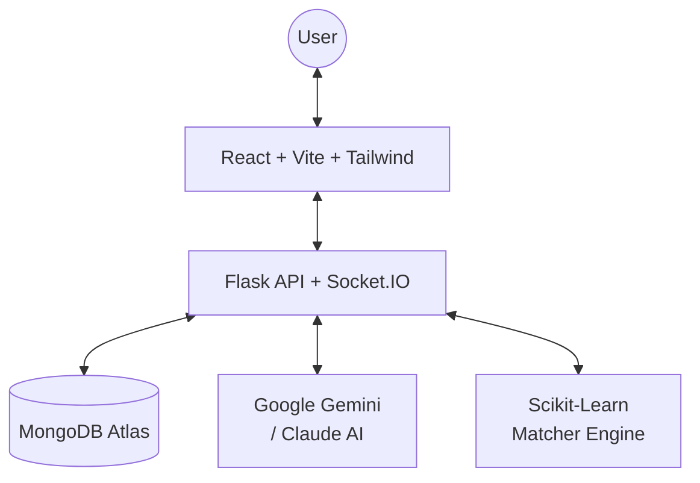

#  Pathway 🚀

> **Empowering professionals with AI-driven career pathfinding and skill-gap intelligence.**

[](https://reactjs.org/)
[](https://flask.palletsprojects.com/)
[](https://www.mongodb.com/)
[](https://ai.google.dev/)
[](https://render.com/)

Pathway is a data-driven career growth platform that helps users bridge the gap between their current skills and their dream roles. By leveraging **Google Gemini AI** and real-time market data, Pathway provides actionable roadmaps, interactive learning labs, and AI-powered resume analysis.

---

## ✨ Key Features

| Feature | Description |
| :--- | :--- |
| **🎯 Career Pathfinding** | Tailored roadmaps based on your target role and current expertise. |
| **📊 Skill Gap Analysis** | Interactive visualizations of your "Market Readiness" score. |
| **🧪 AI Skills Lab** | Real-time coding challenges with AI hints and adaptive feedback. |
| **🤖 Pathway Assistant** | A persistent AI coach powered by Gemini for 24/7 career guidance. |
| **🎮 Skill Simulations** | Realistic, scenario-based evaluations (SQL, React, Algorithms). |
| **📄 AI Resume Analyzer** | Instant ATS scoring and keyword suggestions for your CV. |
| **🏆 XP & Gamification** | Level up your profile as you master new skills and challenges. |

---

## 🏗 System Architecture



---

## 📂 Project Structure

```bash
Pathway/
├── 🧠 backend/           # Flask API, Socket.IO, Intelligence Engines
│   ├── app.py            # Main application entry point
│   ├── matcher.py        # ML-based Career Matching logic
│   ├── ai_lab.py         # AI Challenge generation
│   └── requirements.txt  # Python environment dependencies
├── 🎨 frontend/          # React v18 + Vite (Premium UI)
│   ├── src/              # Components, Contexts, Hooks
│   ├── public/           # Static assets & icons
│   └── .env.example      # Environment variable template
├── 📦 frontend_legacy/   # Legacy assets & styles
└── 📄 README.md          # Project documentation
```

---

## 🚀 Local Setup

### 🛠 Prerequisites
- **Python 3.9+**
- **Node.js 18+**
- **MongoDB Atlas** (or local instance)
- **Google Gemini API Key**

### 1️⃣ Clone the Repository
```bash
git clone https://github.com/laradharshini/Pathway.git
cd Pathway
```

### 2️⃣ Backend Configuration
```bash
# Navigate to root
pip install -r backend/requirements.txt

# Create .env in root
# JWT_SECRET_KEY=...
# MONGO_URI=...
# GEMINI_API_KEY=...

python backend/app.py
```

### 3️⃣ Frontend Configuration
```bash
cd frontend
npm install

# Create .env in frontend/
# VITE_FIREBASE_API_KEY=...
# VITE_FIREBASE_AUTH_DOMAIN=...
# (See .env.example for more)

npm run dev
```

---

## 🌐 Deployment (Render)

Pathway is configured for **Unified Deployment**. The backend serves the optimized React visual build.

1. **Build Frontend**: `cd frontend && npm install && npm run build`
2. **Launch Backend**: `gunicorn --chdir backend app:app`

---

> [!WARNING]
> **Security Reminder**: Never commit your `.env` files. Ensure you have added your secrets to the Render Environment Variables tab before deploying.

---
Created with ❤️ by **[Lara Dharshini](https://github.com/laradharshini)**
