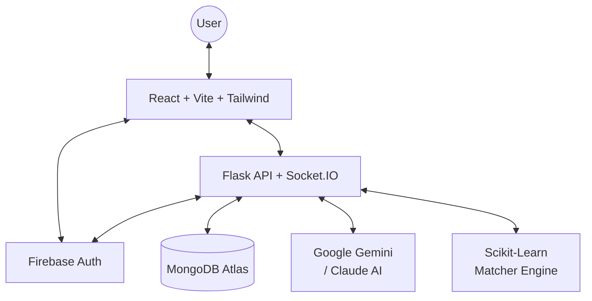

# Pathway

> **Empowering professionals with AI-driven career pathfinding and skill-gap intelligence.**

[](https://www.python.org/)
[](https://flask.palletsprojects.com/)
[](https://reactjs.org/)
[](https://tailwindcss.com/)
[](https://socket.io/)
[](https://scikit-learn.org/)
[](https://firebase.google.com/)
[](https://www.mongodb.com/)
[](https://ai.google.dev/)
[](https://www.anthropic.com/)
[](https://render.com/)

Pathway is a state-of-the-art career growth platform designed to bridge the gap between human potential and market demand. By integrating **Google Gemini** & **Anthropic Claude** with proprietary **ML Matcher Engines**, Pathway provides an end-to-end ecosystem for career discovery, skill validation, and job readiness.

---

> [!TIP]
> **Infrastructure as Code**: This project is configured with a `render.yaml` blueprint. Any changes to the build or start commands made in GitHub will automatically sync to Render.


## Key Features

| Feature | Description |
| :--- | :--- |
| **Secure Auth** | Multi-provider login (Google, Email) via **Firebase Authentication**. |
| **Career Pathfinding** | Tailored roadmaps based on your target role and current expertise. |
| **Skill Gap Analysis** | Interactive visualizations of your "Market Readiness" score. |
| **AI Skills Lab** | Real-time coding challenges with AI hints and adaptive feedback. |
| **Pathway Assistant** | A persistent AI coach powered by Gemini for 24/7 career guidance. |
| **Skill Simulations** | Realistic, scenario-based evaluations (SQL, React, Algorithms). |
| **AI Resume Analyzer** | Instant ATS scoring and keyword suggestions for your CV. |
| **XP & Gamification** | Level up your profile as you master new skills and challenges. |


## 🛠 Technologies & Tools

### **Frontend**
- **Core**: React 18, Vite
- **Styling**: Tailwind CSS, Framer Motion (Animations)
- **Icons**: Lucide React, Heroicons
- **Authentication**: Firebase Authentication
- **State Management**: React Context API

### **Backend**
- **Language**: Python 3.11+
- **Framework**: Flask, Flask-CORS, Flask-SocketIO
- **AI/ML**: Google Gemini AI, Anthropic Claude AI, Scikit-Learn (TF-IDF Matcher)
- **Data**: PyPDF2 (Resume parsing), Pandas/NumPy (Data processing)
- **Database**: MongoDB Atlas

### **DevOps & Deployment**
- **Hosting**: Render (Unified Web Service)
- **CI/CD**: Render Blueprint (Infrastructure as Code)
- **Security**: JWT (Backend sessions), Environment Variables (.env)

---

## 🏗 System Architecture



---

## 📂 Project Structure

```bash
Pathway/
├── 🧠 backend/           # Flask API, Socket.IO, Intelligence Engines
│   ├── app.py            # Main entry point & API routes
│   ├── matcher.py        # ML-based Career Matching logic
│   ├── ai_lab.py         # AI Challenge generation (Claude)
│   ├── simulation_engine.py # Evaluation logic for simulations
│   └── requirements.txt  # Python dependencies
├── 🎨 frontend/          # React v18 + Vite (Premium UI)
│   ├── src/              # Logic, Components, Contexts
│   ├── public/           # Static assets
│   ├── .env.example      # Template for environment variables
│   └── .env              # Local secrets (ignored by Git)
├── 📦 frontend_legacy/   # Legacy assets & styles
├── 📄 render.yaml        # Infrastructure as Code (Blueprint)
└── 📄 README.md          # Project documentation
```

## Local Setup

### 1. Prerequisites
- **Python 3.9+**
- **Node.js 18+**
- **MongoDB Atlas** (or local instance)
- **Firebase Project** (with Auth enabled)
- **Google Gemini API Key**

### 2. Clone the Repository
```bash
git clone https://github.com/laradharshini/Pathway.git
cd Pathway
```

### 3. Backend Configuration
```bash
# Navigate to root
pip install -r backend/requirements.txt

# Create .env in root
# JWT_SECRET_KEY=...
# MONGO_URI=...
# GEMINI_API_KEY=...

python backend/app.py
```

### 4. Frontend Configuration
```bash
cd frontend
npm install

# Create .env in frontend/
# VITE_FIREBASE_API_KEY=...
# VITE_FIREBASE_AUTH_DOMAIN=...
# (See .env.example for more)

npm run dev
```

## Deployment (Render)

Pathway is configured for **Unified Deployment**. The backend serves the optimized React visual build.

1. **Build Frontend**: `cd frontend && npm install && npm run build`
2. **Launch Backend**: `gunicorn --chdir backend app:app`

> [!WARNING]
> **Security Reminder**: Never commit your `.env` files. Ensure you have added your secrets to the Render Environment Variables tab before deploying.

